# Tresor-Anwendung: Authentifizierung und Autorisierung - Technische Dokumentation

## Beantworte die Fragen mit Mermaid Flow Diagrammen

### 1. Login mit Email und Passwort - Flow

```mermaid
flowchart TD
    A["🔐 Frontend: User Login Form<br/>Email + Password + MFA Token"] --> B["📤 POST /api/users/login<br/>JSON: {email, password, mfaToken}"]
    B --> C["🔍 Backend: UserController.doLoginUser()"]
    C --> D["📋 Input Validation<br/>BindingResult.hasErrors()"]
    D --> E{❓ Valid Input?}
    E -->|No| F["❌ Return 400 Bad Request<br/>Validation Errors"]
    E -->|Yes| G["🔍 Find User by Email<br/>userService.findByEmail()"]
    G --> H{❓ User exists?}
    H -->|No| I["❌ Return 401 Unauthorized<br/>User not found"]
    H -->|Yes| J["🔐 Verify Password<br/>passwordService.verifyPassword()<br/>BCrypt + Pepper"]
    J --> K{❓ Password valid?}
    K -->|No| L["❌ Return 401 Unauthorized<br/>Invalid password"]
    K -->|Yes| M{❓ MFA enabled?}
    M -->|No| N["🎫 Generate JWT Token<br/>jwtUtil.generateToken()"]
    M -->|Yes| O["🔢 Verify TOTP Token<br/>TOTPSecretGenerator.verifyToken()"]
    O --> P{❓ MFA valid?}
    P -->|No| Q["❌ Return 401 Unauthorized<br/>Invalid MFA token"]
    P -->|Yes| N
    N --> R["✅ Return Success Response<br/>{token, userId, firstName, lastName, email}"]
    R --> S["💾 Frontend: Store in localStorage<br/>token, userId, userEmail, isLoggedIn"]
    S --> T["🏠 Navigate to Dashboard"]

    F --> U["🖥️ Display Error Message"]
    I --> U
    L --> U
    Q --> U
```



### 2. User Secrets auflisten - Flow

```mermaid
flowchart TD
    A["🔐 Frontend: Secrets Page Load<br/>User navigates to /secrets"] --> B["✅ Check Login Status<br/>localStorage.getItem('isLoggedIn')"]
    B --> C{❓ User logged in?}
    C -->|No| D["❌ Display Login Error<br/>'No valid email, please login first'"]
    C -->|Yes| E["📤 POST /api/secrets/byemail<br/>Body: {email, encryptPassword}<br/>Header: Authorization: Bearer token"]
    E --> F["🔍 Backend: SecretController.getSecretsByEmail()"]
    F --> G["🔑 JWT Auth Filter<br/>JwtAuthFilterImpl.doFilterInternal()"]
    G --> H["🎫 Validate JWT Token<br/>jwtUtil.validateToken()"]
    H --> I{❓ JWT valid?}
    I -->|No| J["❌ Return 401 Unauthorized<br/>Invalid token"]
    I -->|Yes| K["🔍 Find User by Email<br/>userService.findByEmail()"]
    K --> L["📋 Get User Secrets<br/>secretService.getSecretsByUserId()"]
    L --> M{❓ Secrets found?}
    M -->|No| N["❌ Return 404 Not Found<br/>No secrets"]
    M -->|Yes| O["🔄 Loop through Secrets<br/>For each secret in list"]
    O --> P["🔓 Decrypt Secret Content<br/>EncryptUtil.decrypt(userPassword)"]
    P --> Q{❓ Decryption successful?}
    Q -->|No| R["⚠️ Set content to<br/>'not encryptable. Wrong password?'"]
    Q -->|Yes| S["✅ Keep decrypted content"]
    R --> T{❓ More secrets?}
    S --> T
    T -->|Yes| O
    T -->|No| U["📤 Return Decrypted Secrets List<br/>List&lt;Secret&gt; with plaintext content"]
    U --> V["🖥️ Frontend: Display Secrets<br/>Render secrets in UI"]

    J --> W["🖥️ Display Auth Error"]
    N --> X["🖥️ Display 'No secrets found'"]
```



### 3. Web Security Configuration - Flow

```mermaid
flowchart TD
    A["🌐 HTTP Request arrives"] --> B["🔐 Security Filter Chain<br/>SecurityConfig.filterChain()"]
    B --> C["🔍 Check Request Path<br/>request.getRequestURI()"]
    C --> D{❓ Public endpoint?}
    D -->|Yes| E["✅ Permit All<br/>/api/users/login<br/>/api/users/register<br/>/oauth2/**<br/>/api/users/request-password-reset<br/>/api/users/reset-password"]
    D -->|No| F["🔑 JWT Auth Filter<br/>JwtAuthFilterImpl.doFilterInternal()"]
    F --> G["🔍 Check Authorization Header<br/>Authorization: Bearer token"]
    G --> H{❓ Bearer token present?}
    H -->|No| I["❌ Return 401 Unauthorized<br/>No token provided"]
    H -->|Yes| J["🎫 Extract JWT Token<br/>authHeader.substring(7)"]
    J --> K["🔐 Validate JWT<br/>jwtUtil.validateToken()"]
    K --> L{❓ JWT valid?}
    L -->|No| M["❌ Return 401 Unauthorized<br/>Invalid token"]
    L -->|Yes| N["👤 Extract User Email<br/>jwtUtil.extractSubject()"]
    N --> O["🔍 Load User Details<br/>userDetailsService.loadUserByUsername()"]
    O --> P["🏷️ Extract Role from JWT<br/>jwtUtil.extractRole()"]
    P --> Q["🔐 Create Authentication<br/>UsernamePasswordAuthenticationToken"]
    Q --> R["📋 Set Authentication in Context<br/>SecurityContextHolder.setAuthentication()"]
    R --> S["🔍 Check Endpoint Authorization<br/>Based on role and path"]
    S --> T{❓ Role authorized?}
    T -->|No| U["❌ Return 403 Forbidden<br/>Insufficient permissions"]
    T -->|Yes| V["✅ Continue to Controller<br/>Process request"]

    E --> W["🔄 Process Request<br/>No authentication required"]
    V --> W
```



### 4. JWT Token-Erstellung und Authentifizierung - Flow

```mermaid
flowchart TD
    subgraph "🎫 JWT Token Generation"
        A["✅ User Successfully Authenticated<br/>Login or OAuth2 success"] --> B["🔧 JwtUtil.generateToken()<br/>Parameters: email, role"]
        B --> C["⏰ Get Current Timestamp<br/>Date now = new Date()"]
        C --> D["⏳ Calculate Expiry<br/>now + 24 hours (86400000ms)"]
        D --> E["🏗️ Create JWT Builder<br/>Jwts.builder()"]
        E --> F["📧 Set Subject<br/>.subject(userEmail)"]
        F --> G["🏷️ Set Role Claim<br/>.claim('role', userRole)"]
        G --> H["⏰ Set Issued At<br/>.issuedAt(now)"]
        H --> I["⏳ Set Expiration<br/>.expiration(expiryDate)"]
        I --> J["🔐 Sign with Secret Key<br/>.signWith(HMAC_SHA256_key)"]
        J --> K["📦 Compact to String<br/>.compact()"]
        K --> L["🎫 Return JWT Token<br/>eyJhbGciOiJIUzI1NiJ9..."]
    end

    subgraph "🔐 JWT Token Validation"
        M["🌐 Request with Authorization Header<br/>Authorization: Bearer token"] --> N["🔍 Extract Bearer Token<br/>authHeader.substring(7)"]
        N --> O["🔧 JwtUtil.validateToken()<br/>Parse JWT with secret key"]
        O --> P["🔐 Verify Signature<br/>HMAC SHA256 verification"]
        P --> Q{❓ Signature valid?}
        Q -->|No| R["❌ Throw JwtException<br/>Invalid signature"]
        Q -->|Yes| S["⏳ Check Expiration<br/>Claims.getExpiration()"]
        S --> T{❓ Token expired?}
        T -->|Yes| U["❌ Throw ExpiredJwtException<br/>Token expired"]
        T -->|No| V["📋 Extract Claims<br/>Subject, Role, IssuedAt"]
        V --> W["📧 Extract Subject (Email)<br/>claims.getSubject()"]
        W --> X["🏷️ Extract Role<br/>claims.get('role')"]
        X --> Y["🔐 Create Authentication<br/>UsernamePasswordAuthenticationToken"]
        Y --> Z["📋 Set Security Context<br/>SecurityContextHolder.setAuthentication()"]
    end

    L --> M
    R --> AA["🚫 Authentication Failed"]
    U --> AA
    Z --> BB["✅ Authentication Successful<br/>Continue to controller"]
```



### 5. 2FA (Two-Factor Authentication) - Flow

```mermaid
flowchart TD
    subgraph "🔐 2FA Setup during Registration"
        A["📝 User Registration<br/>POST /api/users"] --> B["🔐 Generate TOTP Secret<br/>TOTPSecretGenerator.generateSecret()"]
        B --> C["🎲 Create 160-bit Random Secret<br/>SecureRandom + Base32 encoding"]
        C --> D["💾 Store Secret in Database<br/>user.mfaSecret = secret"]
        D --> E["📱 Generate TOTP URI<br/>otpauth://totp/TresorApp:email?secret=XXX&issuer=TresorApp"]
        E --> F["📤 Return URI to Frontend<br/>Response includes totpUri"]
        F --> G["📱 Frontend: Generate QR Code<br/>QRCodeCanvas component"]
        G --> H["👤 User: Scan QR Code<br/>Google Authenticator / Authy"]
        H --> I["📱 Authenticator App: Store Secret<br/>Generates 6-digit codes every 30s"]
    end

    subgraph "🔒 2FA Verification during Login"
        J["🔐 User Login Request<br/>Email + Password + MFA Token"] --> K["✅ Verify Email & Password<br/>Standard authentication"]
        K --> L{❓ User has MFA secret?}
        L -->|No| M["✅ Login Successful<br/>No 2FA required"]
        L -->|Yes| N["🔢 Check MFA Token<br/>TOTPSecretGenerator.verifyToken()"]
        N --> O["🔧 GoogleAuthenticator.authorize()<br/>Validate 6-digit code"]
        O --> P["⏰ Calculate Time Window<br/>Current 30s + Previous 30s + Next 30s"]
        P --> Q["🔢 Generate Expected Codes<br/>For each time window"]
        Q --> R{❓ User code matches?}
        R -->|No| S["❌ Return 401 Unauthorized<br/>'Invalid MFA token'"]
        R -->|Yes| T["✅ 2FA Verified<br/>Continue login process"]
        T --> U["🎫 Generate JWT Token<br/>jwtUtil.generateToken()"]
        U --> V["✅ Login Successful<br/>Return user data + token"]
    end

    subgraph "🔢 TOTP Algorithm"
        W["🔐 Shared Secret (160-bit)"] --> X["⏰ Current Unix Timestamp"]
        X --> Y["➗ Divide by 30 seconds<br/>Time Counter T"]
        Y --> Z["🔐 HMAC-SHA1(Secret, T)<br/>Generate 20-byte hash"]
        Z --> AA["✂️ Dynamic Truncation<br/>Extract 31-bit value"]
        AA --> BB["🔢 Modulo 1,000,000<br/>6-digit TOTP code"]
        BB --> CC["⏰ Valid for 30 seconds<br/>Same code on app & server"]
    end

    I --> J
    V --> DD["🏠 Navigate to Dashboard"]
    S --> EE["🖥️ Display MFA Error"]
```



### 6. OAuth2 (Google Login) - Flow

```mermaid
flowchart TD
    subgraph "🌐 OAuth2 Google Login Flow"
        A["🔘 User clicks 'Sign in with Google'<br/>Frontend button"] --> B["🔀 Redirect to OAuth2 Endpoint<br/>window.location.href = '/oauth2/authorization/google'"]
        B --> C["🔀 Spring Security Redirect<br/>Redirect to Google OAuth2 server"]
        C --> D["🔐 Google Authentication<br/>User enters Google credentials"]
        D --> E["✅ Google Returns Auth Code<br/>Authorization code in callback"]
        E --> F["🎫 Exchange Code for Token<br/>Spring Security exchanges code"]
        F --> G["🔧 CustomOAuth2UserService<br/>loadUser() method called"]
        G --> H["📡 Fetch User Info from Google<br/>Google API call with access token"]
        H --> I["📋 Extract User Data<br/>email, name, googleId"]
        I --> J{❓ User exists in database?}
        J -->|No| K["👤 Create New User<br/>User newUser = new User()"]
        J -->|Yes| L["👤 Load Existing User<br/>userRepository.findByEmail()"]
        K --> M["💾 Save User to Database<br/>userRepository.save(newUser)"]
        L --> N["🎯 CustomOAuth2SuccessHandler<br/>onAuthenticationSuccess()"]
        M --> N
        N --> O["🎫 Generate JWT Token<br/>jwtUtil.generateToken(email, role)"]
        O --> P["🔗 Build Redirect URL<br/>http://localhost:3000/oauth2/redirect"]
        P --> Q["📤 Add Query Parameters<br/>?token=XXX&email=XXX&userId=XXX"]
        Q --> R["🔀 Redirect to Frontend<br/>response.sendRedirect()"]
        R --> S["🖥️ Frontend: OAuth2RedirectHandler<br/>Extract params from URL"]
        S --> T["💾 Store Token & User Data<br/>localStorage.setItem()"]
        T --> U["🏠 Navigate to Dashboard<br/>navigate('/')"]
    end

    subgraph "👤 User Creation Process"
        V["📧 Extract from Google<br/>email, name, sub (googleId)"] --> W["👤 Create User Object<br/>new User()"]
        W --> X["📧 Set Email<br/>user.setEmail(email)"]
        X --> Y["👤 Set Names<br/>user.setFirstName(name)"]
        Y --> Z["🏷️ Set Role<br/>user.setRole(USER)"]
        Z --> AA["🔐 Generate Empty Password<br/>Placeholder for OAuth users"]
        AA --> BB["💾 Save to Database<br/>userRepository.save(user)"]
    end

    subgraph "🔐 Security Integration"
        CC["🔑 JWT Token includes<br/>email, role, expiry"] --> DD["🔍 Same JWT validation<br/>as email/password login"]
        DD --> EE["🔐 Same authorization rules<br/>Role-based access control"]
        EE --> FF["📋 Same Security Context<br/>SecurityContextHolder"]
    end

    K --> V
    O --> CC
    U --> GG["✅ User Logged In<br/>Full access to application"]
```



### 7. Gesamte Security Architecture - Overview

```mermaid
flowchart TB
    subgraph "🖥️ Frontend (React)"
        A["🔐 Login Page<br/>Email/Password + MFA"]
        B["📝 Registration Page<br/>hCaptcha + User Info"]
        C["🗂️ Secrets Dashboard<br/>Encrypted secrets display"]
        D["📱 MFA Setup Page<br/>QR Code for authenticator"]
        E["🌐 OAuth2 Handler<br/>Google login processing"]
    end

    subgraph "🔐 Backend Security Layer"
        F["🛡️ Security Filter Chain<br/>HTTP request filtering"]
        G["🔑 JWT Auth Filter<br/>Token validation"]
        H["🔐 Password Encryption<br/>BCrypt + Pepper"]
        I["🔢 TOTP Generator<br/>2FA verification"]
        J["🌐 OAuth2 Services<br/>Google integration"]
        K["🤖 Captcha Service<br/>hCaptcha validation"]
    end

    subgraph "🎛️ Controllers & Services"
        L["👤 User Controller<br/>Authentication endpoints"]
        M["🗂️ Secret Controller<br/>Encrypted data access"]
        N["📧 Email Service<br/>Password reset emails"]
        O["🔐 Encryption Util<br/>AES secret encryption"]
    end

    subgraph "🌐 External Services"
        P["🔍 Google OAuth2 API<br/>User authentication"]
        Q["🤖 hCaptcha API<br/>Bot protection"]
        R["📧 Email Service<br/>SMTP mail delivery"]
    end

    subgraph "💾 Database Layer"
        S["👤 User Table<br/>BCrypt passwords + MFA secrets"]
        T["🗂️ Secret Table<br/>AES encrypted content"]
        U["🔑 Password Reset Table<br/>Temporary reset tokens"]
    end

    subgraph "🔒 Security Features"
        V["🎫 JWT Tokens<br/>Stateless authentication"]
        W["🔐 BCrypt + Pepper<br/>Password hashing"]
        X["🔢 TOTP 2FA<br/>Time-based codes"]
        Y["🔐 AES Encryption<br/>Secret content protection"]
        Z["🛡️ Role-based Access<br/>USER/ADMIN permissions"]
    end

    A --> L
    B --> L
    C --> M
    D --> L
    E --> J

    F --> G
    G --> V
    L --> H
    L --> I
    M --> O
    J --> P
    K --> Q
    N --> R

    L --> S
    M --> T
    L --> U

    H --> W
    I --> X
    O --> Y
    F --> Z

    classDef frontend fill:#e1f5fe
    classDef backend fill:#f3e5f5
    classDef external fill:#e8f5e8
    classDef database fill:#fff3e0
    classDef security fill:#ffebee

    class A,B,C,D,E frontend
    class F,G,H,I,J,K,L,M,N,O backend
    class P,Q,R external
    class S,T,U database
    class V,W,X,Y,Z security
```



## Übersicht

Diese Dokumentation zeigt die verschiedenen Authentifizierungs- und Autorisierungsmechanismen der Tresor-Anwendung und erklärt, wo im Code diese implementiert sind.

### System Architecture Overview


### User Registration Flow


## 1. Login mit Email und Passwort

### Login Flow Overview


### Frontend Implementation (LoginUser.js)

Der Login-Prozess beginnt im Frontend in der Datei `LoginUser.js`:

```javascript
// 183_12_2_tresorfrontend_rupe-master/src/pages/user/LoginUser.js
const handleSubmit = async (e) => {
  e.preventDefault();
  console.log("Submitting login data:", loginValues);

  try {
    const response = await fetch("http://localhost:8080/api/users/login", {
      method: "POST",
      headers: {
        "Content-Type": "application/json",
      },
      body: JSON.stringify({
        email: loginValues.email,
        password: loginValues.password,
        mfaToken: loginValues.mfaToken,
      }),
    });

    console.log("Response status:", response.status);
    const data = await response.json();

    if (response.ok) {
      console.log("Login successful:", data);
      // Speichere Token und User-Daten in localStorage
      localStorage.setItem("userId", data.userId);
      localStorage.setItem("userEmail", data.email);
      localStorage.setItem("token", data.token);
      localStorage.setItem("password", loginValues.password);
      localStorage.setItem("isLoggedIn", "true");
      navigate("/");
    }
  } catch (error) {
    console.error("Error during login:", error);
    setErrorMessage("An error occurred during login. Please try again.");
  }
};
```

### Backend Implementation (UserController.java)

Der Backend-Login-Endpoint verarbeitet die Authentifizierung:

```java
// 183_12_1_tresorbackend_rupe-master/src/main/java/ch/bbw/pr/tresorbackend/controller/UserController.java
@PostMapping("/login")
public ResponseEntity<String> doLoginUser(@RequestBody LoginUser loginUser, BindingResult bindingResult) {
    logger.info("UserController.doLoginUser: Attempting login for email: {}", loginUser.getEmail());

    // 1. Input validation
    if (bindingResult.hasErrors()) {
        // Validierungsfehler behandeln
        logger.error("UserController.doLoginUser: Validation failed: {}", json);
        return ResponseEntity.badRequest().body(json);
    }

    // 2. Find user by email
    User user = userService.findByEmail(loginUser.getEmail());
    if (user == null) {
        logger.warn("UserController.doLoginUser: No user found with email: {}", loginUser.getEmail());
        return ResponseEntity.status(HttpStatus.UNAUTHORIZED).body(json);
    }

    // 3. Verify password
    boolean passwordMatches = passwordService.verifyPassword(loginUser.getPassword(), user.getPassword());
    if (!passwordMatches) {
        logger.warn("UserController.doLoginUser: Password mismatch for user: {}", user.getEmail());
        return ResponseEntity.status(HttpStatus.UNAUTHORIZED).body(json);
    }

    // 4. Verify MFA token (2FA)
    if (!user.getMfaSecret().isEmpty() && !TOTPSecretGenerator.verifyToken(user.getMfaSecret(), Integer.parseInt(loginUser.getMfaToken()))) {
        logger.warn("UserController.doLoginUser: Invalid MFA token for user: {}", user.getEmail());
        return ResponseEntity.status(HttpStatus.UNAUTHORIZED).body(json);
    }

    // 5. Login successful - Generate JWT Token
    logger.info("UserController.doLoginUser: Login successful for user ID: {}", user.getId());
    String token = jwtUtil.generateToken(user.getEmail(), user.getRole().name());

    // 6. Return user data and token
    JsonObject obj = new JsonObject();
    obj.addProperty("token", token);
    obj.addProperty("userId", user.getId());
    obj.addProperty("firstName", user.getFirstName());
    obj.addProperty("lastName", user.getLastName());
    obj.addProperty("email", user.getEmail());

    return ResponseEntity.ok().body(json);
}
```

## 2. User Secrets auflisten

### Secrets Retrieval Flow


### Frontend Implementation (Secrets.js)

Das Frontend ruft die User-Secrets über eine spezielle API auf:

```javascript
// 183_12_2_tresorfrontend_rupe-master/src/pages/secret/Secrets.js
useEffect(() => {
  const fetchSecrets = async () => {
    setErrorMessage("");
    if (!loginValues.email) {
      console.error(
        "Secrets: No valid email, please do login first:" + loginValues
      );
      setErrorMessage("No valid email, please do login first.");
    } else {
      try {
        const data = await getSecretsforUser(loginValues);
        setSecrets(data);
      } catch (error) {
        console.error("Failed to fetch to server:", error.message);
        setErrorMessage(error.message);
      }
    }
  };
  fetchSecrets();
}, [loginValues]);
```

### API Call (FetchSecrets.js)

Die tatsächliche API-Anfrage erfolgt in `FetchSecrets.js`:

```javascript
// 183_12_2_tresorfrontend_rupe-master/src/comunication/FetchSecrets.js
export const getSecretsforUser = async (loginValues) => {
  try {
    const requestBody = {
      email: loginValues.email,
      encryptPassword: loginValues.password,
    };

    const response = await fetch(`${API_URL}/secrets/byemail`, {
      method: "POST",
      headers: {
        "Content-Type": "application/json",
        Authorization: `Bearer ${localStorage.getItem("token")}`, // JWT Token für Authorization
      },
      body: JSON.stringify(requestBody),
    });

    console.log("Raw response status:", response.status);
    const responseText = await response.text();
    console.log("Raw response body:", responseText);

    if (!response.ok) {
      throw new Error(errorData.message || "Server response failed.");
    }

    let data = JSON.parse(responseText);
    console.log("Secrets successfully retrieved:", data);
    return data;
  } catch (error) {
    console.error("Failed to get secrets:", error);
    throw new Error("Failed to get secrets: " + error.message);
  }
};
```

### Backend Implementation (SecretController.java)

Der Backend-Controller verarbeitet die Secrets-Anfrage:

```java
// 183_12_1_tresorbackend_rupe-master/src/main/java/ch/bbw/pr/tresorbackend/controller/SecretController.java
@PostMapping("/byemail")
public ResponseEntity<List<Secret>> getSecretsByEmail(@RequestBody EncryptCredentials credentials) {
    System.out.println("Yay in the controller");
    System.out.println("SecretController.getSecretsByEmail " + credentials);

    // 1. Find user by email
    User user = userService.findByEmail(credentials.getEmail());

    // 2. Get all secrets for this user
    List<Secret> secrets = secretService.getSecretsByUserId(user.getId());
    if (secrets.isEmpty()) {
        System.out.println("SecretController.getSecretsByEmail secret isEmpty");
        return ResponseEntity.notFound().build();
    }

    // 3. Decrypt content for each secret
    for(Secret secret: secrets) {
        try {
            secret.setContent(new EncryptUtil(credentials.getEncryptPassword()).decrypt(secret.getContent()));
        } catch (EncryptionOperationNotPossibleException e) {
            System.out.println("SecretController.getSecretsByEmail " + e + " " + secret);
            secret.setContent("not encryptable. Wrong password?");
        }
    }

    System.out.println("SecretController.getSecretsByEmail " + secrets);
    return ResponseEntity.ok(secrets);
}
```

## 3. Backend Web Security Konfiguration

### Security Filter Chain Flow


### SecurityConfig.java - Zentrale Sicherheitskonfiguration

```java
// 183_12_1_tresorbackend_rupe-master/src/main/java/ch/bbw/pr/tresorbackend/config/SecurityConfig.java
@Configuration
@EnableWebSecurity
public class SecurityConfig {

    @Bean
    public SecurityFilterChain filterChain(HttpSecurity http, JwtAuthFilterImpl jwtAuthFilter,
            CustomOAuth2UserServiceImpl oAuth2UserService,
            CustomOAuth2SuccessHandlerImpl oAuth2SuccessHandler) throws Exception {
        http
                // CSRF deaktiviert für development
                .csrf(csrf -> csrf.disable())

                // URL-basierte Autorisierung
                .authorizeHttpRequests(auth -> auth
                        // Öffentliche Endpoints (ohne Authentifizierung)
                        .requestMatchers("/", "/api/users/login", "/api/users/register", "/oauth2/**",
                                "/login/oauth2/code/**", "/api/users/request-password-reset",
                                "/api/users/reset-password")
                        .permitAll()

                        // User Registration erlaubt
                        .requestMatchers(HttpMethod.POST, "/api/users").permitAll()

                        // Secrets nur für USER und ADMIN
                        .requestMatchers("/api/secrets/**").hasAnyRole("USER", "ADMIN")

                        // User-Management nur für ADMIN
                        .requestMatchers(HttpMethod.GET, "/api/users/**").hasRole("ADMIN")

                        // Alle anderen Requests benötigen Authentifizierung
                        .anyRequest().authenticated())

                // OAuth2 Login Configuration
                .oauth2Login(oauth -> oauth
                        .userInfoEndpoint(info -> info.userService(oAuth2UserService))
                        .successHandler(oAuth2SuccessHandler))

                // JWT Filter vor UsernamePasswordAuthenticationFilter
                .addFilterBefore(jwtAuthFilter, UsernamePasswordAuthenticationFilter.class);

        return http.build();
    }

    @Bean
    public PasswordEncoder passwordEncoder() {
        return new BCryptPasswordEncoder();  // BCrypt für Password-Hashing
    }
}
```

### UserDetailsService Implementation

```java
// 183_12_1_tresorbackend_rupe-master/src/main/java/ch/bbw/pr/tresorbackend/service/impl/UserDetailsServiceImpl.java
@Service("userDetailsServiceImpl")
@RequiredArgsConstructor
public class UserDetailsServiceImpl implements UserDetailsService {

    private final UserRepository userRepository;

    @Override
    public UserDetails loadUserByUsername(String email) throws UsernameNotFoundException {
        var user = userRepository.findByEmail(email)
                .orElseThrow(() -> new UsernameNotFoundException("User not found"));

        return new org.springframework.security.core.userdetails.User(
                user.getEmail(),
                user.getPassword(),
                List.of(new SimpleGrantedAuthority("ROLE_" + user.getRole().name()))
        );
    }
}
```

## 4. JWT Token-Erstellung und Authentifizierung

### JWT Token Generation Flow


### JWT Token Validation Flow


### JWT Token Generierung (JwtUtil.java)

```java
// 183_12_1_tresorbackend_rupe-master/src/main/java/ch/bbw/pr/tresorbackend/util/JwtUtil.java
@Component
public class JwtUtil {
    // Sicherheitsschlüssel (in Produktion aus sicherer Quelle laden)
    private final Key key = Keys.hmacShaKeyFor("your-256-bit-secret-key-here-must-be-long-enough".getBytes(StandardCharsets.UTF_8));
    private final long expirationMs = 86400000; // 24 Stunden

    // JWT Token generieren
    public String generateToken(String subject, String role) {
        Date now = new Date();
        Date expiryDate = new Date(now.getTime() + expirationMs);

        return Jwts.builder()
                .subject(subject)           // User Email als Subject
                .claim("role", role)        // User Role als Claim
                .issuedAt(now)             // Erstellungszeit
                .expiration(expiryDate)    // Ablaufzeit
                .signWith(key)             // Signierung mit Secret Key
                .compact();
    }

    // Subject (Email) aus Token extrahieren
    public String extractSubject(String token) {
        return parseClaims(token).getPayload().getSubject();
    }

    // Token validieren
    public boolean validateToken(String token) {
        try {
            parseClaims(token);
            return true;
        } catch (JwtException | IllegalArgumentException e) {
            return false;
        }
    }

    // Role aus Token extrahieren
    public String extractRole(String token) {
        return parseClaims(token).getPayload().get("role", String.class);
    }

    // Token parsen und Claims extrahieren
    private Jws<Claims> parseClaims(String token) {
        return Jwts.parser()
                .verifyWith((SecretKey) key)
                .build()
                .parseSignedClaims(token);
    }
}
```

### JWT Authentication Filter (JwtAuthFilterImpl.java)

```java
// 183_12_1_tresorbackend_rupe-master/src/main/java/ch/bbw/pr/tresorbackend/service/impl/JwtAuthFilterImpl.java
@Component
public class JwtAuthFilterImpl extends OncePerRequestFilter {

    private final JwtUtil jwtUtil;
    private final UserDetailsService userDetailsService;

    @Override
    protected void doFilterInternal(HttpServletRequest request, HttpServletResponse response,
            FilterChain filterChain) throws ServletException, IOException {

        // Öffentliche Pfade definieren, die JWT-Check umgehen
        String path = request.getRequestURI();
        if (path.startsWith("/api/users/login") ||
                path.startsWith("/api/users/register") ||
                path.startsWith("/oauth2") ||
                path.startsWith("/login/oauth2")) {
            filterChain.doFilter(request, response);
            return;
        }

        final String authHeader = request.getHeader("Authorization");
        final String jwt;
        final String userEmail;

        // Authorization Header prüfen
        if (authHeader == null || !authHeader.startsWith("Bearer ")) {
            filterChain.doFilter(request, response);
            return;
        }

        // JWT Token extrahieren (ohne "Bearer " Prefix)
        jwt = authHeader.substring(7);

        try {
            // Username aus JWT extrahieren
            userEmail = jwtUtil.extractSubject(jwt);

            // Wenn Email vorhanden und noch keine Authentifizierung gesetzt
            if (userEmail != null && SecurityContextHolder.getContext().getAuthentication() == null) {

                // User Details laden
                UserDetails userDetails = this.userDetailsService.loadUserByUsername(userEmail);

                // Token validieren
                if (jwtUtil.validateToken(jwt)) {
                    // Role aus JWT extrahieren
                    String role = jwtUtil.extractRole(jwt);

                    // Authentication Token mit Authorities erstellen
                    List<SimpleGrantedAuthority> authorities = List.of(
                            new SimpleGrantedAuthority("ROLE_" + role));

                    UsernamePasswordAuthenticationToken authToken = new UsernamePasswordAuthenticationToken(
                            userDetails, null, authorities);

                    authToken.setDetails(new WebAuthenticationDetailsSource().buildDetails(request));

                    // Authentication in Security Context setzen
                    SecurityContextHolder.getContext().setAuthentication(authToken);
                }
            }
        } catch (Exception e) {
            logger.error("JWT Authentication failed", e);
        }

        filterChain.doFilter(request, response);
    }
}
```

## 5. 2FA (Multi-Factor Authentication) Implementation

### 2FA Setup Flow


### 2FA Verification Flow


### How TOTP (Time-based One-Time Password) Works


### TOTP Secret Generation (TOTPSecretGenerator.java)

```java
// 183_12_1_tresorbackend_rupe-master/src/main/java/ch/bbw/pr/tresorbackend/service/impl/TOTPSecretGenerator.java
public class TOTPSecretGenerator {

    // TOTP Secret generieren (160-bit, Base32 encodiert)
    public static String generateSecret() {
        byte[] buffer = new byte[20]; // 160-bit secret (recommended)
        new SecureRandom().nextBytes(buffer);
        Base32 base32 = new Base32();
        return base32.encodeToString(buffer).replace("=", "");
    }

    // TOTP Token verifizieren
    public static boolean verifyToken(String secret, int code) {
        GoogleAuthenticator gAuth = new GoogleAuthenticator();
        return gAuth.authorize(secret, code);
    }
}
```

### User Registration mit MFA Setup

```java
// 183_12_1_tresorbackend_rupe-master/src/main/java/ch/bbw/pr/tresorbackend/controller/UserController.java
@PostMapping
public ResponseEntity<String> createUser(@Valid @RequestBody RegisterUser registerUser, BindingResult bindingResult) {
    // ... Validation und Password-Checks ...

    // User erstellen mit TOTP Secret
    User user = new User(
          null,
          registerUser.getFirstName(),
          registerUser.getLastName(),
          registerUser.getEmail(),
          passwordService.hashPassword(registerUser.getPassword()),
          TOTPSecretGenerator.generateSecret(),  // MFA Secret generieren
          User.Role.USER
          );

    userService.createUser(user);

    // TOTP URI für QR-Code generieren
    JsonObject obj = new JsonObject();
    obj.addProperty("answer", "User Saved");
    obj.addProperty("totpUri", String.format("otpauth://totp/%s:%s?secret=%s&issuer=%s",
      "TresorApp", user.getEmail(), user.getMfaSecret(), "TresorApp"));

    return ResponseEntity.accepted().body(json);
}
```

### MFA Setup Frontend (SetupMFA.js)

```javascript
// 183_12_2_tresorfrontend_rupe-master/src/pages/user/SetupMFA.js
function SetupMFA() {
  const query = new URLSearchParams(useLocation().search);
  const totpUri = query.get("totpUri");

  if (!totpUri) {
    return <p>Error: TOTP setup link missing.</p>;
  }

  const secret = totpUri.split("secret=")[1].split("&")[0];

  return (
    <div>
      <h2>Multi-Factor Authentication Setup</h2>
      <p>
        Scan this QR code with your Authenticator app (e.g., Google
        Authenticator or Authy):
      </p>
      <QRCodeCanvas value={totpUri} size={200} />
      <p>Or enter this secret manually:</p>
      <code style={{ fontSize: "1.2rem" }}>{secret}</code>
    </div>
  );
}
```

### MFA Verification während Login

```java
// Im UserController Login-Endpoint
// Verify MFA token
if (!user.getMfaSecret().isEmpty() && !TOTPSecretGenerator.verifyToken(user.getMfaSecret(), Integer.parseInt(loginUser.getMfaToken()))) {
    logger.warn("UserController.doLoginUser: Invalid MFA token for user: {}", user.getEmail());

    JsonObject obj = new JsonObject();
    obj.addProperty("message", "Invalid MFA token");
    String json = new Gson().toJson(obj);

    return ResponseEntity.status(HttpStatus.UNAUTHORIZED).body(json);
}
```

## 6. OAuth2 Implementation (Google Login)

### OAuth2 Google Login Flow


### OAuth2 User Creation Flow


### OAuth2 User Service

```java
// 183_12_1_tresorbackend_rupe-master/src/main/java/ch/bbw/pr/tresorbackend/service/impl/CustomOAuth2UserServiceImpl.java
@Service
public class CustomOAuth2UserServiceImpl implements OAuth2UserService<OAuth2UserRequest, OAuth2User> {

    private final UserRepository userRepository;

    @Override
    public OAuth2User loadUser(OAuth2UserRequest userRequest) {
        var delegate = new DefaultOAuth2UserService();
        OAuth2User oAuth2User = delegate.loadUser(userRequest);

        // Google User Info extrahieren
        String email = oAuth2User.getAttribute("email");
        String name = oAuth2User.getAttribute("name");

        // User in DB finden oder erstellen
        User user = userRepository.findByEmail(email)
                .orElseGet(() -> {
                    User newUser = new User();
                    newUser.setEmail(email);
                    newUser.setFirstName(name);
                    newUser.setLastName(name);
                    newUser.setRole(User.Role.USER);
                    return userRepository.save(newUser);
                });

        return new DefaultOAuth2User(
            Collections.singleton(new SimpleGrantedAuthority(user.getRole().name())),
            oAuth2User.getAttributes(),
            "email"
        );
    }
}
```

### OAuth2 Success Handler

```java
// 183_12_1_tresorbackend_rupe-master/src/main/java/ch/bbw/pr/tresorbackend/service/impl/CustomOAuth2SuccessHandlerImpl.java
@Component
public class CustomOAuth2SuccessHandlerImpl implements AuthenticationSuccessHandler {

    @Override
    public void onAuthenticationSuccess(HttpServletRequest request,
                                        HttpServletResponse response,
                                        Authentication authentication)
            throws IOException, ServletException {

        var principal = (DefaultOAuth2User) authentication.getPrincipal();
        String email = principal.getAttribute("email");
        String name = principal.getAttribute("name");
        String googleId = principal.getAttribute("sub");

        // User finden oder erstellen
        User user = userRepository.findByEmail(email)
                .orElseGet(() -> createNewUser(email, name, googleId));

        // JWT Token generieren
        String jwt = jwtUtil.generateToken(user.getEmail(), user.getRole().name());

        // Redirect URL mit Token erstellen
        String redirectUrl = UriComponentsBuilder
                .fromUriString("http://localhost:3000/oauth2/redirect")
                .queryParam("token", jwt)
                .queryParam("email", user.getEmail())
                .queryParam("userId", user.getId())
                .queryParam("password", user.getPassword())
                .build().toUriString();

        response.sendRedirect(redirectUrl);
    }
}
```

### OAuth2 Frontend Integration

```javascript
// Google Login Button im Frontend
<button
  onClick={() =>
    (window.location.href = "http://localhost:8080/oauth2/authorization/google")
  }
  style={googleButtonStyle}
>
  <svg width="18" height="18" viewBox="0 0 24 24">
    {/* Google Logo SVG */}
  </svg>
  Sign in with Google
</button>
```

### OAuth2 Redirect Handler

```javascript
// 183_12_2_tresorfrontend_rupe-master/src/pages/user/OAuth2RedirectHandler.js
const OAuth2RedirectHandler = ({ setLoginValues }) => {
  const navigate = useNavigate();

  useEffect(() => {
    const params = new URLSearchParams(window.location.search);
    const token = params.get("token");
    const email = params.get("email");
    const userId = params.get("userId");
    const password = params.get("password");

    if (token && email && userId && password) {
      // Token und User-Daten in localStorage speichern
      localStorage.setItem("token", token);
      localStorage.setItem("userEmail", email);
      localStorage.setItem("userId", userId);
      localStorage.setItem("isLoggedIn", "true");
      localStorage.setItem("password", password);

      // Login-State setzen
      if (setLoginValues) {
        setLoginValues({ email, password });
      }

      navigate("/");
    } else {
      console.error("OAuth2 callback missing required parameters");
      navigate("/user/login");
    }
  }, [navigate, setLoginValues]);

  return <p>Redirecting...</p>;
};
```

## 7. Password Hashing und Verschlüsselung

### Password Hashing Flow


### Secret Encryption/Decryption Flow

```mermaid
flowchart TD
    A[User creates secret] --> B[Use user password as encryption key]
    B --> C[EncryptUtil encrypt]
    C --> D[AES encryption with user password]
    D --> E[Store encrypted content in database]

    F[User retrieves secrets] --> G[Get encrypted content from database]
    G --> H[Use user password for decryption]
    H --> I[EncryptUtil decrypt]
    I --> J{Decryption successful?}
    J -->|Yes| K[Return plaintext content]
    J -->|No| L["Return 'not encryptable. Wrong password?'"]
```

### Password Encryption Service

```java
// 183_12_1_tresorbackend_rupe-master/src/main/java/ch/bbw/pr/tresorbackend/service/PasswordEncryptionService.java
@Service
public class PasswordEncryptionService {

   @Value("${app.security.pepper}")
   private String pepper;

   private static final int BCRYPT_COST = 12;

   // Passwort hashen mit BCrypt und Pepper
   public String hashPassword(String password) {
      String passwordWithPepper = password + pepper;
      return BCrypt.hashpw(passwordWithPepper, BCrypt.gensalt(BCRYPT_COST));
   }

   // Passwort verifizieren
   public boolean verifyPassword(String password, String hashedPassword) {
      String passwordWithPepper = password + pepper;
      return BCrypt.checkpw(passwordWithPepper, hashedPassword);
   }
}
```

## 8. Logging Configuration

Das System verwendet umfassendes Logging für alle wichtigen Operationen:

### Login Logging

```java
logger.info("UserController.doLoginUser: Attempting login for email: {}", loginUser.getEmail());
logger.warn("UserController.doLoginUser: No user found with email: {}", loginUser.getEmail());
logger.warn("UserController.doLoginUser: Password mismatch for user: {}", user.getEmail());
logger.warn("UserController.doLoginUser: Invalid MFA token for user: {}", user.getEmail());
logger.info("UserController.doLoginUser: Login successful for user ID: {}", user.getId());
```

### Secret Operations Logging

```java
System.out.println("SecretController.getSecretsByEmail " + credentials);
System.out.println("SecretController.getSecretsByEmail secret isEmpty");
System.out.println("SecretController.getSecretsByEmail " + secrets);
```

### Frontend Console Logging

```javascript
console.log("Submitting login data:", loginValues);
console.log("Response status:", response.status);
console.log("Login successful:", data);
console.log("Raw response status:", response.status);
console.log("Raw response body:", responseText);
```

## 9. Password Reset Flow

### Password Reset Request Flow

```mermaid
flowchart TD
    A[User clicks 'Forgot Password'] --> B[User enters email address]
    B --> C[Send POST to /api/users/request-password-reset]
    C --> D[Backend finds user by email]
    D --> E{User exists?}
    E -->|No| F[Return success but don't send email]
    E -->|Yes| G[Generate secure random token]
    G --> H[Set token expiry 1 hour]
    H --> I[Save token to password_reset_token table]
    I --> J[Send email with reset link]
    J --> K[Email contains: resetlink?token=XXX]
    K --> L[User clicks link in email]
    L --> M[Frontend loads reset form with token]
    M --> N[User enters new password]
    N --> O[Send POST to /api/users/reset-password]
    O --> P[Backend validates token]
    P --> Q{Token valid & not expired?}
    Q -->|No| R[Return 400 Invalid/Expired token]
    Q -->|Yes| S[Hash new password with BCrypt + pepper]
    S --> T[Update user password in database]
    T --> U[Delete used reset token]
    U --> V[Return success]
    V --> W[Frontend redirects to login]

    F --> X[Return 'If email exists, reset link sent']
```

## 10. Datenbank Schema

```sql
-- 183_12_1_tresorbackend_rupe-master/src/main/resources/tresordb.sql
CREATE TABLE `user` (
    id BIGINT NOT NULL AUTO_INCREMENT,
    first_name VARCHAR(30) NOT NULL,
    last_name VARCHAR(30) NOT NULL,
    email VARCHAR(30) NOT NULL UNIQUE,
    password LONGTEXT NOT NULL,           -- BCrypt Hash
    mfa_secret VARCHAR(32) DEFAULT NULL,  -- TOTP Secret für 2FA
    role ENUM('ADMIN', 'USER') NOT NULL DEFAULT 'USER',
    PRIMARY KEY (id)
) ENGINE=InnoDB;

CREATE TABLE secret (
    id BIGINT NOT NULL AUTO_INCREMENT,
    user_id BIGINT NOT NULL,
    content LONGTEXT NOT NULL,            -- Verschlüsselter Inhalt
    PRIMARY KEY (id),
    FOREIGN KEY (user_id) REFERENCES `user`(id) ON DELETE CASCADE
) ENGINE=InnoDB;

CREATE TABLE password_reset_token (
    id BIGINT NOT NULL AUTO_INCREMENT,
    user_id BIGINT NOT NULL,
    token VARCHAR(255) NOT NULL UNIQUE,
    expires_at TIMESTAMP NOT NULL,
    PRIMARY KEY (id),
    FOREIGN KEY (user_id) REFERENCES `user`(id) ON DELETE CASCADE
) ENGINE=InnoDB;
```

## 11. Captcha Implementation

### Captcha Verification Flow

```mermaid
flowchart TD
    A[User completes hCaptcha] --> B[Frontend receives captcha token]
    B --> C[Send registration request with token]
    C --> D[Backend CaptchaService.verifyToken]
    D --> E[Prepare hCaptcha verification request]
    E --> F[POST to https://hcaptcha.com/siteverify]
    F --> G[Include secret key + response token]
    G --> H[hCaptcha API validates]
    H --> I{Captcha valid?}
    I -->|No| J[Return verification failed]
    I -->|Yes| K[Return verification successful]
    K --> L[Continue with user registration]
    J --> M[Reject registration request]
```

### Backend Captcha Service

```java
// 183_12_1_tresorbackend_rupe-master/src/main/java/ch/bbw/pr/tresorbackend/service/CaptchaService.java
@Service
public class CaptchaService {

    @Value("${hcaptcha.secret}")
    private String secretKey;

    public boolean verifyToken(String token) {
        if (token == null || token.isEmpty()) return false;

        RestTemplate restTemplate = new RestTemplate();
        HttpHeaders headers = new HttpHeaders();
        headers.setContentType(MediaType.APPLICATION_FORM_URLENCODED);

        MultiValueMap<String, String> params = new LinkedMultiValueMap<>();
        params.add("secret", secretKey);
        params.add("response", token);

        HttpEntity<MultiValueMap<String, String>> request = new HttpEntity<>(params, headers);

        try {
            ResponseEntity<Map> response = restTemplate.postForEntity(
                "https://hcaptcha.com/siteverify", request, Map.class);

            Map<String, Object> body = response.getBody();
            return (Boolean) body.get("success");
        } catch (Exception e) {
            System.out.println("Captcha verification failed: " + e.getMessage());
            return false;
        }
    }
}
```

## 12. Zusammenfassung der Sicherheitsfeatures

1. **Passwort-Sicherheit**: BCrypt-Hashing mit Pepper und hohem Cost-Factor (12)
2. **JWT-basierte Session-Verwaltung**: Stateless Authentication mit signierten Tokens
3. **2FA/MFA**: TOTP-basierte Zwei-Faktor-Authentifizierung mit Google Authenticator
4. **OAuth2 Integration**: Google Login mit automatischer User-Erstellung
5. **Role-based Authorization**: USER/ADMIN Rollen mit unterschiedlichen Berechtigungen
6. **Captcha-Schutz**: hCaptcha Integration für Registrierung
7. **Password Reset**: Sichere Token-basierte Passwort-Wiederherstellung
8. **Content Encryption**: AES-Verschlüsselung für sensitive Secret-Daten
9. **CORS Configuration**: Sichere Cross-Origin-Konfiguration
10. **Comprehensive Logging**: Ausführliches Logging aller Sicherheitsereignisse

Diese Implementierung zeigt eine moderne, mehrstufige Sicherheitsarchitektur mit verschiedenen Authentifizierungsmethoden und umfassenden Schutzmaßnahmen gegen gängige Sicherheitsbedrohungen.
