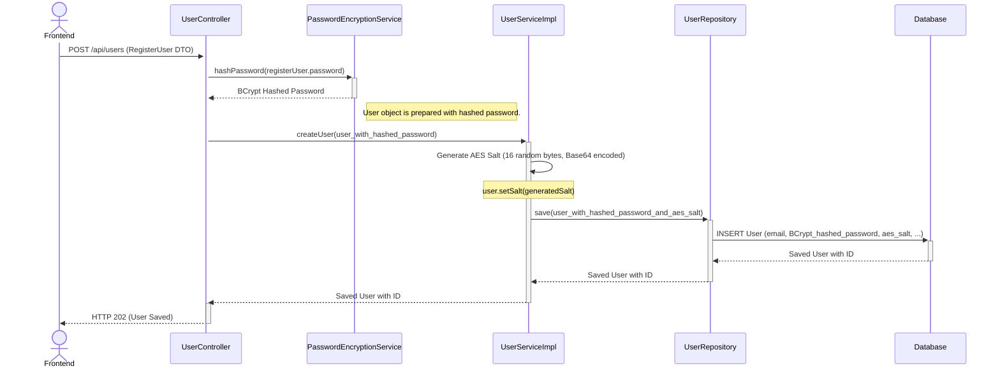
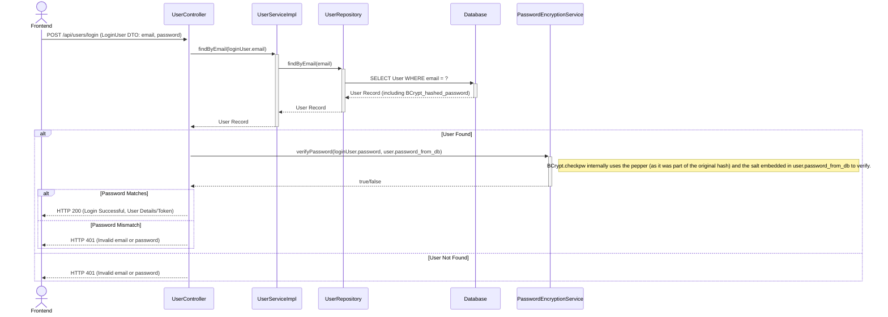
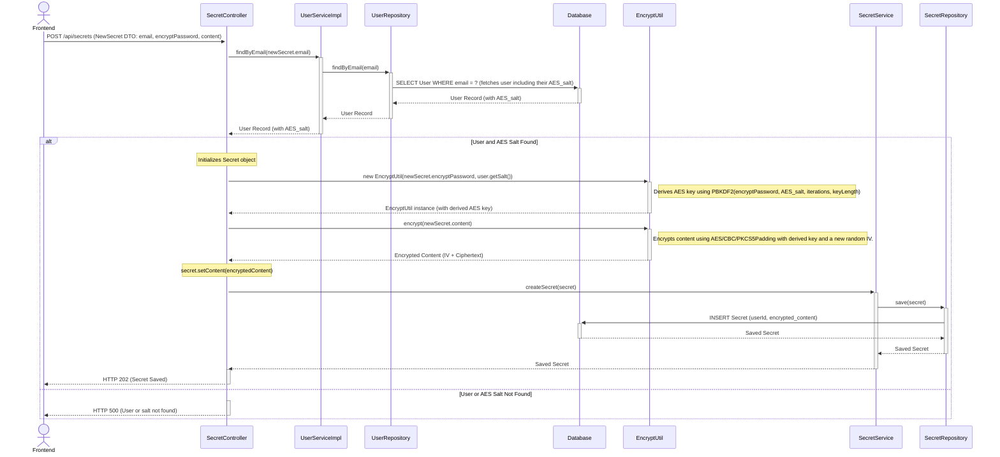
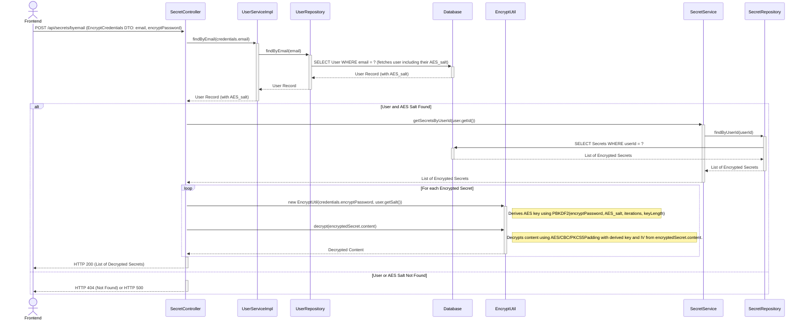

# Solution: Enhancing Secret Encryption with User-Specific Salts

This document details the implementation of user-specific salts for deriving AES encryption keys, enhancing the security of secret storage.

## 1. WHAT Changes Were Made

The following modifications were implemented in the backend:

1.  **`User.java` (Entity):**

    - Added a new `String` field named `salt` to store a unique salt for each user. This salt is specifically for deriving the AES encryption key for their secrets, and is distinct from any salt used by BCrypt for password hashing.

2.  **`UserServiceImpl.java` (Service):**

    - The `createUser` method was updated to generate a cryptographically secure 16-byte random salt for each new user.
    - This salt is Base64 encoded and stored in the user's `salt` field before the user record is saved to the database.

3.  **`EncryptUtil.java` (Utility):**

    - The constructor was changed from `EncryptUtil(String secretPassword)` to `EncryptUtil(String secretPassword, String saltString)`.
    - Key derivation was changed from a direct SHA-256 hash of the password to using **PBKDF2WithHmacSHA256**.
    - This function uses the provided `secretPassword`, the user's decoded `saltString`, a defined `ITERATION_COUNT` (65536), and `KEY_LENGTH` (256 bits) to generate a robust AES key (`SecretKeySpec`).

4.  **`SecretController.java` (Controller):**

    - All methods performing encryption or decryption (`createSecret2`, `getSecretsByUserId`, `getSecretsByEmail`, `updateSecret`) were modified.
    - Before calling `new EncryptUtil(...)`, these methods now fetch the relevant `User` object to retrieve their stored `salt`.
    - Both the `encryptPassword` (from the request) and the user's `salt` are passed to the `EncryptUtil` constructor.
    - Null checks for the user and their salt were added to handle cases where they might be missing (especially for users created before this change).

5.  **`UserController.java` (Controller):**
    - The `createUser` method was adjusted to instantiate the `User` object using its no-argument constructor followed by setters (e.g., `User user = new User(); user.setFirstName(...)`). This was necessary because the `@AllArgsConstructor` from Lombok on the `User` entity now includes the `salt` field, and the salt is intended to be generated and set within the `UserServiceImpl` layer, not directly in the controller during initial object creation.

## 2. HOW Changes Were Implemented

### 2.1. Salt Generation and Storage (`User.java` & `UserServiceImpl.java`)

A `salt` field was added to the `User` entity:

```diff
--- a/183_12_1_tresorbackend_rupe-master/src/main/java/ch/bbw/pr/tresorbackend/model/User.java
+++ b/183_12_1_tresorbackend_rupe-master/src/main/java/ch/bbw/pr/tresorbackend/model/User.java
@@ -25,4 +25,7 @@

    @Column(nullable = false)
    private String password;
+
+   @Column(nullable = true) // Initially nullable for existing users, will be set for new users
+   private String salt;
 }
```

In `UserServiceImpl.java`, the `createUser` method now generates and stores this salt:

```java
// ... imports ...
import java.security.SecureRandom;
import java.util.Base64;

// ... class definition ...
   @Override
   public User createUser(User user) {
      // Generate a salt for the new user
      SecureRandom random = new SecureRandom();
      byte[] saltBytes = new byte[16]; // 16 bytes = 128 bits, a common salt length
      random.nextBytes(saltBytes);
      user.setSalt(Base64.getEncoder().encodeToString(saltBytes));
      return userRepository.save(user);
   }
// ...
```

**Explanation:** When a new user is registered, a 16-byte cryptographically strong random salt is generated using `SecureRandom`. This byte array is then encoded into a Base64 string and set on the `User` object before it's persisted. This ensures each user has a unique salt for their secret encryption key derivation.

### 2.2. PBKDF2 Key Derivation (`EncryptUtil.java`)

The `EncryptUtil` constructor was updated to perform key derivation using PBKDF2:

```diff
--- a/183_12_1_tresorbackend_rupe-master/src/main/java/ch/bbw/pr/tresorbackend/util/EncryptUtil.java
+++ b/183_12_1_tresorbackend_rupe-master/src/main/java/ch/bbw/pr/tresorbackend/util/EncryptUtil.java
@@ -1,9 +1,9 @@
 package ch.bbw.pr.tresorbackend.util;

 import javax.crypto.Cipher;
+import javax.crypto.SecretKeyFactory;
 import javax.crypto.spec.IvParameterSpec;
+import javax.crypto.spec.PBEKeySpec;
 import javax.crypto.spec.SecretKeySpec;
 import java.nio.charset.StandardCharsets;
-import java.security.MessageDigest;
 import java.security.SecureRandom;
+import java.security.spec.KeySpec;
 import java.util.Base64;

@@ -16,16 +16,18 @@n public class EncryptUtil {
    private final SecretKeySpec secretKeySpec;
    private static final String ALGORITHM = "AES/CBC/PKCS5Padding";
-   private static final int IV_LENGTH = 16;
+   private static final int IV_LENGTH = 16; // bytes for AES-128/192/256 IV
+   private static final int ITERATION_COUNT = 65536;
+   private static final int KEY_LENGTH = 256; // bits for AES-256

-   public EncryptUtil(String secretKey) {
+   public EncryptUtil(String secretPassword, String saltString) {
       try {
-         MessageDigest sha = MessageDigest.getInstance("SHA-256");
-         byte[] key = sha.digest(secretKey.getBytes(StandardCharsets.UTF_8));
-         // Use first 16 bytes (128-bit AES)
-         this.secretKeySpec = new SecretKeySpec(key, 0, 16, "AES");
+         byte[] salt = Base64.getDecoder().decode(saltString);
+         SecretKeyFactory factory = SecretKeyFactory.getInstance("PBKDF2WithHmacSHA256");
+         KeySpec spec = new PBEKeySpec(secretPassword.toCharArray(), salt, ITERATION_COUNT, KEY_LENGTH);
+         SecretKeySpec generatedSecretKey = new SecretKeySpec(factory.generateSecret(spec).getEncoded(), "AES");
+         this.secretKeySpec = generatedSecretKey;
       } catch (Exception e) {
-         throw new RuntimeException("Error initializing secret key", e);
+         throw new RuntimeException("Error initializing secret key with PBKDF2", e);
       }
    }
```

**Explanation:** Instead of directly hashing the input password, `EncryptUtil` now takes the user's `secretPassword` (which is their login password in the current frontend implementation) and their Base64 encoded `saltString`. The salt string is decoded to bytes. `PBKDF2WithHmacSHA256` is used with an `ITERATION_COUNT` of 65,536 and a desired `KEY_LENGTH` of 256 bits to produce the AES `SecretKeySpec`. This significantly strengthens the key derivation process against brute-force and pre-computation attacks.

### 2.3. Salt Usage in Controller (`SecretController.java`)

In `SecretController`, methods handling secrets now retrieve the user and their salt before interacting with `EncryptUtil`.

Example from `createSecret2`:

```java
// ...
      User user = userService.findByEmail(newSecret.getEmail());
      if (user == null || user.getSalt() == null) {
         // Handle case where user or salt is not found...
         System.out.println("SecretController.createSecret, user or salt not found for email: " + newSecret.getEmail());
         JsonObject obj = new JsonObject();
         obj.addProperty("message", "User or salt not found, cannot create secret.");
         return ResponseEntity.status(HttpStatus.INTERNAL_SERVER_ERROR).body(new Gson().toJson(obj));
      }

      //transfer secret and encrypt content
      Secret secret = new Secret(
            null,
            user.getId(),
            new EncryptUtil(newSecret.getEncryptPassword(), user.getSalt()).encrypt(newSecret.getContent().toString())
      );
// ...
```

Similar changes were made in `getSecretsByUserId`, `getSecretsByEmail`, and `updateSecret` to pass the user's salt when creating an `EncryptUtil` instance for decryption or re-encryption.

### 2.4. User Instantiation (`UserController.java`)

Due to the addition of the `salt` field and Lombok's `@AllArgsConstructor` behavior, the `User` object creation in `UserController.createUser` was changed:

```diff
--- a/183_12_1_tresorbackend_rupe-master/src/main/java/ch/bbw/pr/tresorbackend/controller/UserController.java
+++ b/183_12_1_tresorbackend_rupe-master/src/main/java/ch/bbw/pr/tresorbackend/controller/UserController.java
@@ -79,13 +79,12 @@
       System.out.println("UserController.createUser, password validation passed");

       //transform registerUser to user
-      User user = new User(
-            null,
-            registerUser.getFirstName(),
-            registerUser.getLastName(),
-            registerUser.getEmail(),
-            passwordService.hashPassword(registerUser.getPassword())
-            );
+      User user = new User(); // Use no-args constructor
+      user.setFirstName(registerUser.getFirstName());
+      user.setLastName(registerUser.getLastName());
+      user.setEmail(registerUser.getEmail());
+      user.setPassword(passwordService.hashPassword(registerUser.getPassword()));
+      // The salt will be set by UserServiceImpl.createUser()

       User savedUser = userService.createUser(user);
       System.out.println("UserController.createUser, user saved in db");
```

**Explanation:** The `User` object is now created using its default (no-argument) constructor, and its fields are populated via setter methods. The `salt` is not set here because `UserServiceImpl.createUser()` is responsible for generating and setting it before the user is saved.

## 3. Data Flow for Secret Encryption/Decryption (with Salt)

1.  **User Registration:**

    - Frontend sends registration details.
    - `UserController` receives details.
    - `UserServiceImpl.createUser()` is called.
      - A new unique salt is generated (e.g., 16 random bytes, Base64 encoded).
      - The user's login password is hashed using BCrypt (this is separate from secret encryption).
      - The User object (including the new salt and BCrypt-hashed password) is saved to the database.

2.  **Secret Creation:**

    - Frontend sends new secret data (content, user's email, and the user's login password as `encryptPassword`).
    - `SecretController.createSecret2()` receives the request.
    - It fetches the `User` object from the database using the provided email, which includes the user's stored `salt`.
    - It instantiates `EncryptUtil` with the `encryptPassword` (from frontend) and the user's `salt` (from DB).
    - `EncryptUtil` uses PBKDF2 with this password and salt to derive an AES key.
    - The secret's content is encrypted using this AES key (with a new random IV for each encryption).
    - The encrypted content (IV + ciphertext) is stored in the database.

3.  **Secret Decryption:**
    - Frontend requests secrets for a user (providing email and login password as `encryptPassword`).
    - `SecretController` (e.g., `getSecretsByEmail()`) receives the request.
    - It fetches the `User` object, including their `salt`.
    - For each encrypted secret retrieved from the database for that user:
      - It instantiates `EncryptUtil` with the `encryptPassword` (from frontend) and the user's `salt` (from DB).
      - `EncryptUtil` derives the AES key using PBKDF2 (same process as encryption).
      - The secret content is decrypted.
    - Decrypted secrets are sent to the frontend.

## 4. Impact on Existing Users

Users created _before_ this salt implementation will not have a `salt` value in their database record. Attempts to create or decrypt secrets for these users will fail because the `SecretController` expects a salt. To enable these users:

- They would need to be re-registered (to generate a salt).
- Alternatively, a migration script or admin function could be created to generate and assign salts to existing users. Secrets encrypted prior to this change would still be undecryptable with the new mechanism unless their original encryption key (derived without PBKDF2 and the new salt) was known and used for a one-time re-encryption process.

This implementation significantly enhances the security of the AES key derivation process by using a strong KDF (PBKDF2) and user-specific salts, making it much harder to attack the keys even if the password database is compromised (though the BCrypt hashes for login are still the primary defense there).

## 5. Mermaid Sequence Diagrams of Key Flows

Below are sequence diagrams illustrating the key user and cryptographic flows within the backend.

### 5.1. User Registration Flow



**Explanation:**

- The user's chosen password is combined with a static **pepper** (configured in `application.properties`) and then hashed using **BCrypt** by the `PasswordEncryptionService`. This BCrypt hash (which internally includes its own salt for password hashing) is stored as the user's login password.
- Separately, `UserServiceImpl` generates a new, unique **AES salt** for the user. This AES salt is stored in the `user` table and is used for deriving the key for encrypting/decrypting secrets (not for login).

### 5.2. User Login Flow



**Explanation:**

- When a user logs in, their provided password and the stored BCrypt hash (which includes the original BCrypt salt and was created with the pepper) are processed by `BCrypt.checkpw()`. The pepper is implicitly part of this verification because it was part of the string originally hashed by BCrypt.
- The AES salt stored in the user table is not directly used during the login password verification process.

### 5.3. Secret Creation Flow (with PBKDF2 and AES Salt)



**Explanation:**

- The `encryptPassword` (currently the user's login password from the frontend) and the user's unique **AES salt** (retrieved from the database) are passed to `EncryptUtil`.
- `EncryptUtil` uses **PBKDF2** with this password and AES salt to derive the actual AES encryption key.
- The secret content is then encrypted using this derived AES key and a newly generated IV.

### 5.4. Secret Decryption Flow (with PBKDF2 and AES Salt)



**Explanation:**

- Similar to creation, the `encryptPassword` from the frontend and the user's stored **AES salt** are used by `EncryptUtil` with **PBKDF2** to re-derive the _same_ AES encryption key that was used during encryption.
- This key, along with the IV extracted from the stored encrypted content, is used to decrypt the secret.
