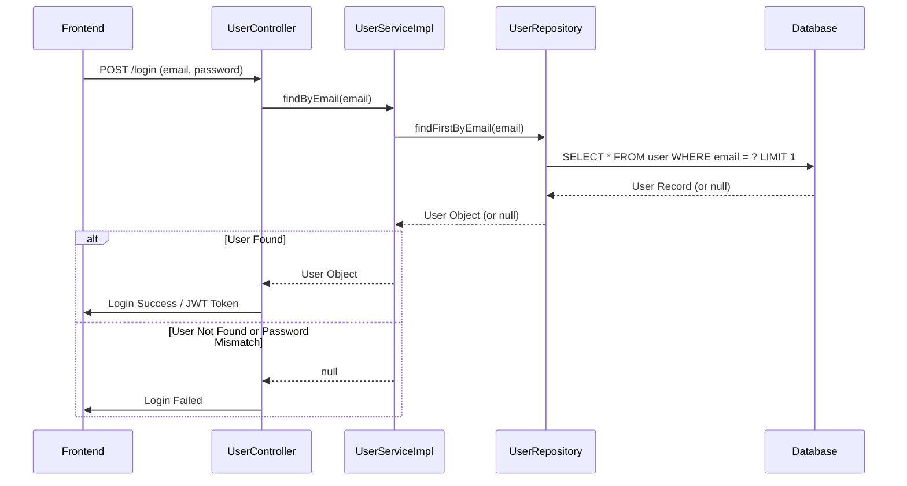

# Fix NonUniqueResultException on User Login

## 1. Problem Description

When a user attempted to log in after a new user was created, the backend threw an `org.hibernate.NonUniqueResultException`. This error indicated that a database query intended to fetch a single user by their email address was instead returning multiple user records with the same email.

## 2. WHAT Changes Were Made

The primary cause was the presence of duplicate email addresses in the `user` table, and the Spring Data JPA repository method `findByEmail` was not prepared to handle this. Although the `User` entity had a `@Column(unique = true)` annotation on the `email` field, this constraint might not have been active or might have been added after duplicates already existed.

The following changes were implemented:

### Backend (`183_12_1_tresorbackend_rupe-master`)

1.  **Modified `UserRepository.java`**:

    - The method `Optional<User> findByEmail(String email);` was changed to `User findFirstByEmail(String email);`.
    - This instructs Spring Data JPA to return only the first user found for a given email, even if multiple exist in the database. This prevents the `NonUniqueResultException`.

    ```diff
    --- a/src/main/java/ch/bbw/pr/tresorbackend/repository/UserRepository.java
    +++ b/src/main/java/ch/bbw/pr/tresorbackend/repository/UserRepository.java
    @@ -8,5 +8,5 @@
     * @author Peter Rutschmann
     */
    public interface UserRepository extends JpaRepository<User, Long> {
    -   Optional<User> findByEmail(String email);
    +   User findFirstByEmail(String email);
    }
    ```

2.  **Modified `UserServiceImpl.java`**:

    - The `findByEmail` method was updated to call the new `findFirstByEmail` method from the `UserRepository`.
    - The handling of `Optional<User>` was removed as the repository method now directly returns a `User` object (or `null` if not found).

    ```diff
    --- a/src/main/java/ch/bbw/pr/tresorbackend/service/impl/UserServiceImpl.java
    +++ b/src/main/java/ch/bbw/pr/tresorbackend/service/impl/UserServiceImpl.java
    @@ -33,8 +33,7 @@

       @Override
       public User findByEmail(String email) {
    -      Optional<User> optionalUser = userRepository.findByEmail(email);
    -      return optionalUser.get();
    +      return userRepository.findFirstByEmail(email);
       }

       @Override
    ```

## 3. HOW the Changes Were Implemented

1.  **Analysis**: The error stack trace clearly pointed to a `NonUniqueResultException` originating from the `userRepository.findByEmail` call when attempting to log in.
2.  **Investigation**:
    - The `UserRepository` was inspected, showing a standard `findByEmail` method returning `Optional<User>`.
    - The `User` entity was checked and already contained `@Column(unique = true)` for the email, suggesting the database schema _should_ enforce uniqueness.
3.  **Solution**:
    - To immediately resolve the runtime exception, the repository method was changed to `findFirstByEmail`. This ensures the application can proceed even if the database contains duplicates (though this is a workaround for the data integrity issue).
    - The corresponding service layer method was updated to use the new repository method.
4.  **Recommendation for Data Integrity**: It was strongly recommended to:
    - Manually inspect the `user` table in the database for duplicate email entries.
    - Clean up any existing duplicates.
    - Verify that the `UNIQUE` constraint on the `email` column is active and enforced by the database to prevent future duplicates.

## 4. Diagrams

### Sequence Diagram (Login Flow - Simplified)



## 5. Further Steps (Data Integrity)

It is critical to clean the existing database to remove duplicate emails and ensure the `UNIQUE` constraint is properly enforced by the database schema. This will prevent the issue from recurring and maintain data integrity.
