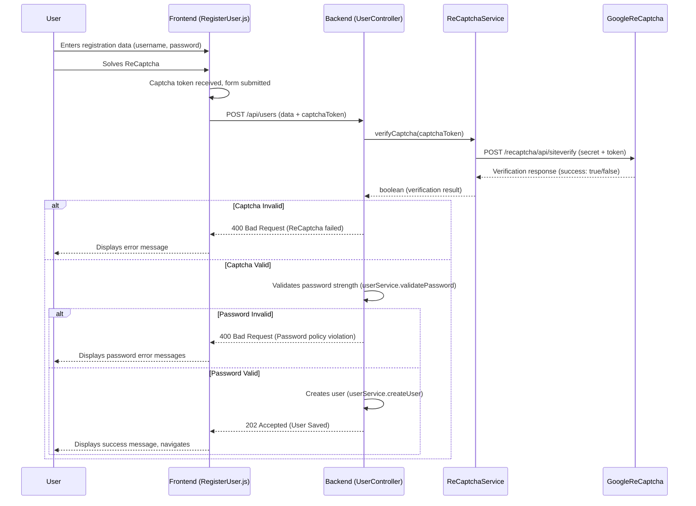
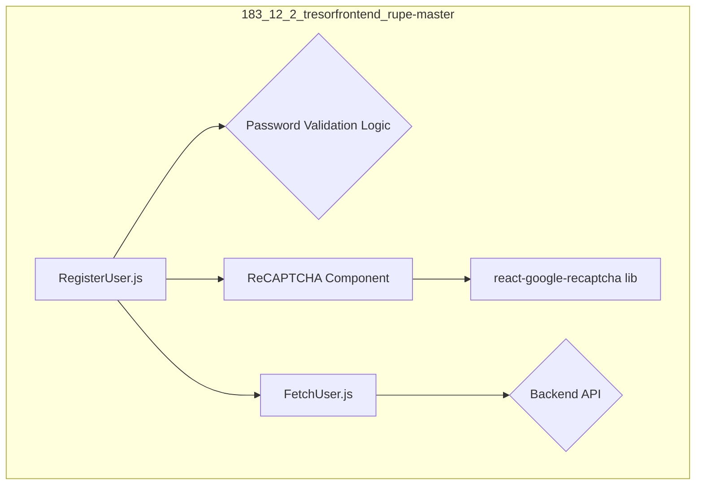
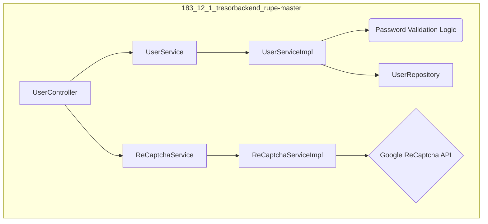

# Solution 03: Password Strength and Captcha Implementation

This document details the implementation of password strength validation and Captcha functionality.

## Password Strength

### Frontend

#### Implementation

Password strength validation is implemented in `183_12_2_tresorfrontend_rupe-master/src/pages/user/RegisterUser.js`.
A `validatePassword` function was added, which checks for the following criteria:

- Minimum 8 characters
- At least one uppercase letter
- At least one lowercase letter
- At least one digit
- At least one special character

This function is called on every change in the password input field and on form submission. Error messages are displayed below the form if validation fails. The password input fields were changed from `type="text"` to `type="password"`.

#### Code Snippets

`183_12_2_tresorfrontend_rupe-master/src/pages/user/RegisterUser.js`:

```javascript
// ...
const [passwordErrors, setPasswordErrors] = useState([]);

const validatePassword = (password) => {
  const errors = [];
  if (password.length < 8) {
    errors.push("Password must be at least 8 characters long.");
  }
  if (!/[A-Z]/.test(password)) {
    errors.push("Password must contain at least one uppercase letter.");
  }
  if (!/[a-z]/.test(password)) {
    errors.push("Password must contain at least one lowercase letter.");
  }
  if (!/[0-9]/.test(password)) {
    errors.push("Password must contain at least one digit.");
  }
  if (!/[^a-zA-Z0-9]/.test(password)) {
    errors.push("Password must contain at least one special character.");
  }
  return errors;
};

const handleSubmit = async (e) => {
  e.preventDefault();
  setErrorMessage("");
  setPasswordErrors([]);

  // ... (ReCaptcha check comes here)

  //validate password strength
  const currentPasswordErrors = validatePassword(credentials.password);
  if (currentPasswordErrors.length > 0) {
    setPasswordErrors(currentPasswordErrors);
    return;
  }
  // ...
};

// ...
<input
  type="password" // Changed from text
  value={credentials.password}
  onChange={(e) => {
    setCredentials((prevValues) => ({
      ...prevValues,
      password: e.target.value,
    }));
    setPasswordErrors(validatePassword(e.target.value));
  }}
  required
  placeholder="Please enter your pwd *"
/>;
// ...
{
  passwordErrors.length > 0 && (
    <div style={{ color: "red" }}>
      <p>Password errors:</p>
      <ul>
        {passwordErrors.map((error, index) => (
          <li key={index}>{error}</li>
        ))}
      </ul>
    </div>
  );
}
// ...
```

### Backend

#### Implementation

Password strength validation is implemented in the backend by adding a `validatePassword` method to the `UserService` interface and its implementation `UserServiceImpl.java`.
This method uses regular expressions to check for the same criteria as the frontend:

- Minimum 8 characters
- At least one uppercase letter
- At least one lowercase letter
- At least one digit
- At least one special character

The `UserController` calls this method during user registration (`createUser` method) and returns a list of error messages if the password does not meet the criteria.

#### Code Snippets

`183_12_1_tresorbackend_rupe-master/src/main/java/ch/bbw/pr/tresorbackend/service/UserService.java`:

```java
// ...
public interface UserService {
   // ...
   List<String> validatePassword(String password);
}
```

`183_12_1_tresorbackend_rupe-master/src/main/java/ch/bbw/pr/tresorbackend/service/impl/UserServiceImpl.java`:

```java
// ...
import java.util.ArrayList;
import java.util.regex.Matcher;
import java.util.regex.Pattern;
// ...
@Service
@AllArgsConstructor
public class UserServiceImpl implements UserService {
   // ...
   @Override
   public List<String> validatePassword(String password) {
      List<String> errors = new ArrayList<>();
      if (password == null || password.length() < 8) {
         errors.add("Password must be at least 8 characters long.");
      }
      if (!Pattern.compile("[A-Z]").matcher(password).find()) {
         errors.add("Password must contain at least one uppercase letter.");
      }
      if (!Pattern.compile("[a-z]").matcher(password).find()) {
         errors.add("Password must contain at least one lowercase letter.");
      }
      if (!Pattern.compile("[0-9]").matcher(password).find()) {
         errors.add("Password must contain at least one digit.");
      }
      if (!Pattern.compile("[^a-zA-Z0-9]").matcher(password).find()) {
         errors.add("Password must contain at least one special character.");
      }
      return errors;
   }
}
```

`183_12_1_tresorbackend_rupe-master/src/main/java/ch/bbw/pr/tresorbackend/controller/UserController.java`:

```java
// ...
   @PostMapping
   public ResponseEntity<String> createUser(@Valid @RequestBody RegisterUser registerUser,
         BindingResult bindingResult) {
      // ... (ReCaptcha check comes here)

      // password validation
      List<String> passwordErrors = userService.validatePassword(registerUser.getPassword());
      if (!passwordErrors.isEmpty()) {
         System.out.println("UserController.createUser, password validation fails: " + passwordErrors);
         JsonArray arr = new JsonArray();
         passwordErrors.forEach(arr::add);
         JsonObject obj = new JsonObject();
         obj.add("message", arr);
         String json = new Gson().toJson(obj);
         return ResponseEntity.badRequest().body(json);
      }
      System.out.println("UserController.createUser, password validation passed");
      // ...
   }
// ...
```

## Captcha (ReCaptcha)

**Note:** The ReCaptcha site key is configured in `183_12_2_tresorfrontend_rupe-master/.env` as `REACT_APP_RECAPTCHA_SITE_KEY` and the secret key is in `183_12_1_tresorbackend_rupe-master/src/main/resources/application.properties` as `google.recaptcha.secret`.

### Frontend

#### Implementation

ReCaptcha v2 ("I'm not a robot" checkbox) is integrated using the `react-google-recaptcha` library.

- The library was installed via `npm install --save react-google-recaptcha`.
- In `183_12_2_tresorfrontend_rupe-master/src/pages/user/RegisterUser.js`:
  - The `ReCAPTCHA` component is imported and added to the registration form.
  - `useRef` is used to get a reference to the ReCaptcha component to reset it after successful registration.
  - `useState` is used to store the ReCaptcha token.
  - The site key is read from `process.env.REACT_APP_RECAPTCHA_SITE_KEY`.
  - The token is obtained via the `onChange` prop of the `ReCAPTCHA` component.
  - If the token is not present during form submission, an error message is displayed.
  - The token is sent to the backend as part of the registration request in the `captchaToken` field. This required updating the `postUser` function in `183_12_2_tresorfrontend_rupe-master/src/comunication/FetchUser.js`.

#### Code Snippets

`183_12_2_tresorfrontend_rupe-master/src/pages/user/RegisterUser.js`:

```javascript
import React, { useState, useRef } from "react";
// ...
import ReCAPTCHA from "react-google-recaptcha";

// ...
const recaptchaRef = useRef();
const [captchaToken, setCaptchaToken] = useState(null);
// ...
const handleSubmit = async (e) => {
  // ...
  if (!captchaToken) {
    setErrorMessage("Please complete the ReCaptcha.");
    return;
  }
  // ...
  try {
    await postUser({ ...credentials, captchaToken: captchaToken }); // Pass token
    // ...
    recaptchaRef.current.reset(); // Reset ReCaptcha
    setCaptchaToken(null); // Clear token state
    // ...
  } catch (error) {
    // ...
  }
};
// ...
<ReCAPTCHA
  ref={recaptchaRef}
  sitekey={process.env.REACT_APP_RECAPTCHA_SITE_KEY}
  onChange={(token) => setCaptchaToken(token)}
  onExpired={() => setCaptchaToken(null)}
/>;
// ...
```

`183_12_2_tresorfrontend_rupe-master/src/comunication/FetchUser.js`:

```javascript
// ...
export const postUser = async (content) => {
    // ...
    try {
        const response = await fetch(`${API_URL}/users`, {
            // ...
            body: JSON.stringify({
                firstName: `${content.firstName}`,
                lastName: `${content.lastName}`,
                email: `${content.email}`,
                password: `${content.password}`,
                passwordConfirmation: `${content.passwordConfirmation}`,
                captchaToken: `${content.captchaToken}` // Added captchaToken
            })
        });
        // ...
    }
    // ...
};
```

### Backend

#### Implementation

ReCaptcha verification is implemented in the backend:

- A `ReCaptchaService` interface and `ReCaptchaServiceImpl.java` were created.
- `ReCaptchaServiceImpl` uses `RestTemplate` to call Google's `siteverify` API (`https://www.google.com/recaptcha/api/siteverify`).
- The ReCaptcha secret key is injected from `application.properties` via `@Value("${google.recaptcha.secret}")`.
- It sends the `secret` key (placeholder `"YOUR_RECAPTCHA_SECRET_KEY"`) and the `response` token received from the frontend.
- The `UserController` is injected with `ReCaptchaService`.
- In the `createUser` method, `reCaptchaService.verifyCaptcha()` is called with the `recaptchaToken` from the `RegisterUser` model.
- If verification fails, a `400 Bad Request` response is returned. The `RegisterUser.java` model already contained a `recaptchaToken` field.

#### Code Snippets

`183_12_1_tresorbackend_rupe-master/src/main/java/ch/bbw/pr/tresorbackend/service/ReCaptchaService.java`:

```java
package ch.bbw.pr.tresorbackend.service;

public interface ReCaptchaService {
    boolean verifyCaptcha(String token);
}
```

`183_12_1_tresorbackend_rupe-master/src/main/java/ch/bbw/pr/tresorbackend/service/impl/ReCaptchaServiceImpl.java`:

```java
package ch.bbw.pr.tresorbackend.service.impl;

import ch.bbw.pr.tresorbackend.service.ReCaptchaService;
import org.springframework.stereotype.Service;
import org.springframework.web.client.RestTemplate;
import org.slf4j.Logger;
import org.slf4j.LoggerFactory;
import org.springframework.beans.factory.annotation.Value;

import java.util.Map; // Was HashMap, but Map is more general for the response type

@Service
public class ReCaptchaServiceImpl implements ReCaptchaService {
    private static final Logger logger = LoggerFactory.getLogger(ReCaptchaServiceImpl.class);
    @Value("${google.recaptcha.secret}")
    private String recaptchaSecret;
    private final String RECAPTCHA_VERIFY_URL = "https://www.google.com/recaptcha/api/siteverify";

    @Override
    public boolean verifyCaptcha(String token) {
        if (token == null || token.isEmpty()) {
            return false;
        }
        RestTemplate restTemplate = new RestTemplate();
        String url = RECAPTCHA_VERIFY_URL + "?secret=" + recaptchaSecret + "&response=" + token;
        try {
            // Google returns a Map, e.g. {success=true, challenge_ts=..., hostname=...}
            @SuppressWarnings("unchecked") // RestTemplate for Map can give unchecked warning
            Map<String, Object> response = restTemplate.postForObject(url, null, Map.class);
            if (response != null && response.containsKey("success")) {
                logger.info("ReCaptcha verification response: " + response);
                return (Boolean) response.get("success");
            }
        } catch (Exception e) {
            logger.error("ReCaptcha verification failed: " + e.getMessage());
        }
        return false;
    }
}
```

`183_12_1_tresorbackend_rupe-master/src/main/java/ch/bbw/pr/tresorbackend/controller/UserController.java`:

```java
// ...
import ch.bbw.pr.tresorbackend.service.ReCaptchaService; // Import
// ...

@RestController
@AllArgsConstructor
@RequestMapping("api/users")
public class UserController {

   private UserService userService;
   private PasswordEncryptionService passwordService;
   private ReCaptchaService reCaptchaService; // Added
   private static final Logger logger = LoggerFactory.getLogger(UserController.class);

   @Autowired // Constructor already existed, just added ReCaptchaService
   public UserController(ConfigProperties configProperties, UserService userService,
         PasswordEncryptionService passwordService, ReCaptchaService reCaptchaService) { // Added reCaptchaService
      // ...
      this.reCaptchaService = reCaptchaService; // Added
   }

   @PostMapping
   public ResponseEntity<String> createUser(@Valid @RequestBody RegisterUser registerUser,
         BindingResult bindingResult) {
      // captcha
      if (!reCaptchaService.verifyCaptcha(registerUser.getRecaptchaToken())) { // Use getRecaptchaToken()
         System.out.println("UserController.createUser: captcha validation failed.");
         JsonObject obj = new JsonObject();
         obj.addProperty("message", "ReCaptcha validation failed.");
         String json = new Gson().toJson(obj);
         return ResponseEntity.badRequest().body(json);
      }
      System.out.println("UserController.createUser: captcha passed.");

      // ... (input validation, password validation) ...
   }
   // ...
}
```

`183_12_1_tresorbackend_rupe-master/src/main/java/ch/bbw/pr/tresorbackend/model/RegisterUser.java` (relevant field):

```java
// ...
public class RegisterUser {
   // ...
   private String recaptchaToken; // This field was already present
}
```

## Sequence Diagram



## Component/Class Diagrams

### Frontend (Illustrative)



### Backend (Illustrative)


